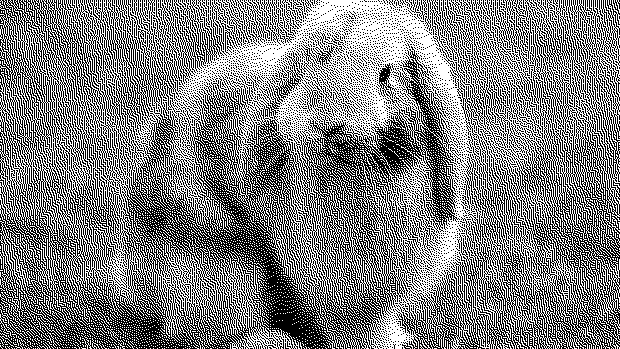
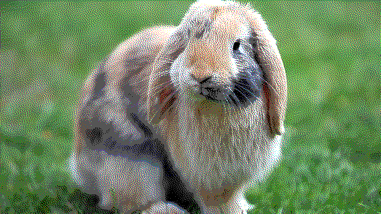

# Dither

Inspired by: <http://www.tannerhelland.com/4660/dithering-eleven-algorithms-source-code/>

- no dithering: 
- one_bit black and white floyd_steinberg dithering 
- CGA 16-color mode, sierra 3 dithering: 

## License: MIT

## CLI help:

```bash
dither --help
```

## usage

```bash
dither INPUT [OUTPUT] [-v] [--dither] [--color] [--depth]
```

example:

```bash
# dither "bunny.ong", output to green_bunny.png, using the atkinson dithering algoirthm, and using two bits of depth for shades of GREEN, emitting debug info to stderr.
dither bunny.png green_bunny.png --dither=atkinson --color=GREEN --depth=2 -v

# dither "bunny.png", output to bunny_crayon.jpg, using the sierra 3 dithering algorithm, and loading it's color palette from crayon.plt
dither bunny.png bunny_crayon.jpg --dither=sierra3 --color="crayon.plt"
```

## args

### `INPUT`

the path to an input image. known good image formats are `.png` and `.jpg`.

### `OUTPUT`

the path to write the output. this will create or truncate the file at the existing location, if necessary. the image type will be inferred from the filename. currently, only `.png` and `.jpg` are supported.

### `-c`, `--color`

The color mode to use. Default is "bw" (black and white). Color mode to use.

#### "color"

(all colors with specified bit depth)

##### "bw"

black and white mode (grayscale in higher birt depths)

#### $COLOR

single-color mode. options are

- BLUE
- GREEN
- CYAN
- RED
- MAGENTA
- BROWN
- LIGHT_GRAY
- GRAY
- LIGHT_BLUE
- LIGHT_GREEN
- LIGHT_CYAN "LIGHT_RED"
- LIGHT_MAGENTA
- YELLOW
- WHITE

#### $FILENAME

load a palette from file. palettes are specified as a list of two or more newline-separated 24-bit hexidecimals, with optional 0x prefix. see `crayon.plt` and `cga.plt` for examples.
```
// WHITE
0xffffff
// BLACK
0x000000
// RED
0xff0000
// GREEN
0x00ff00
// BLUE
0x0000ff
```
### `-d, --dither`

The type of ditherer to use. Available options are

- `"floyd"`, `"steinberg"`, `"floydsteinberg"` _(default, floyd-steinberg dithering)_
- `"atkinson"`,
- `"stucki"`,
- `"burkes"`,
- `"jarvis"`, `"judice"`, `ninke"` _Jarvis-Judice-Ninke dithering_
- `"sierra"`, `"sierra3"` _Sierra_ dithering

### `-v, --verbose`

Verbose debug output to stderr

### `--depth`

Default 1\. Bit depth should be an unsigned integer between 1 and 7\. The number of bits to compress each channel to. This option only works with the options `--color=$COLOR, --color=bw, --color=color`
