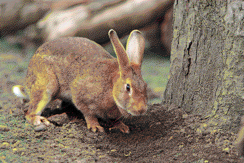

# Dither 1.3.7

Inspired by: <http://www.tannerhelland.com/4660/dithering-eleven-algorithms-source-code/>

* [crate](https://crates.io/crates/dither)
* [documentation](https://docs.rs/dither/1.3.5/dither/)
* [repository](https://gitlab.com/efronlicht/dither)
* [binaries](https://gitlab.com/efronlicht/dither-binaries)
* [dockerfile](https://hub.docker.com/r/efronlicht/dither)

## License: MIT

The test photo ( `"bunny.png"` ) was obtained under the creative common license and is in the public domain.

## Installation

* ### Compilation from source

    - Install rust  by following the instructions at [rustup.rs](https://rustup.rs/)/
    - Install dither

            cargo install dither

* ### Download a binary (x64-windows, x64-linux)

    - Download a binary from the [binaries repository](https://gitlab.com/efronlicht/dither-binaries)

* ### Run directly via Docker

        docker run efronlicht/dither:latest

## CLI help:

``` bash
dither --help
```

## usage

``` bash
dither INPUT [OUTPUT] [-v] [--dither="floyd"] [--color="bw"] [--depth="1"] [--help]
```

## examples

    # no-op


    dither bunny.png burkes.png --dither=burkes


    dither bunny.png crayon.png --color=crayon



# Args

## `INPUT` 

the path to an input image.known good image formats are `.png` and `.jpg` .

## `OUTPUT` 

the path to write the output.this will create or truncate the file at the existing location, if necessary.the image type will be inferred from the filename.currently, only `.png` and `.jpg` are supported.

## `-c` , `--color` 

The color mode to use. Default is "bw" (black and white).
Available options are

* bw (default)
* color
* cga
* crayon
* $COLOR
* $FILENAME

### `--color=bw` (default)

grayscale mode.dither to `--depth` bits; --depth=1 uses pure black and white, --depth=2 uses black, white, and two shades of gray, etc, etc.

### `color=color` 

use RGB channels with specified bit depth.i.e, `--color=color, --depth=2` uses two bits each for the red, green, and blue channels.

### `--color=crayon` 

use the crayon color palette.see "crayon.plt" for details.

### `--color=cga` 

use the [cga](https://en.wikipedia.org/wiki/Color_Graphics_Adapter) color palette.see the wikipedia article or "cga.plt" for details.

### `--color=$COLOR` 

single-color mode.dither in black and white to the specified bit depth, then replace white with the given color, using black for the background.

* BLUE
* GREEN
* CYAN
* RED
* MAGENTA
* BROWN
* LIGHT_GRAY
* GRAY
* LIGHT_BLUE
* LIGHT_GREEN
* LIGHT_CYAN
* LIGHT_RED
* LIGHT_MAGENTA
* YELLOW
* WHITE

### `--color=$FILENAME` 

load a palette from file.palettes are specified as a list of two or more newline-separated 24-bit hexidecimals, with optional 0x prefix.see `crayon.plt` and `cga.plt` for examples.

    // WHITE
    0xffffff
    // BLACK
    0x000000
    // RED
    0xff0000
    // GREEN
    0x00ff00
    // BLUE
    0x0000ff

## `-d, --dither` 

The type of ditherer to use. Available options are

* `"floyd"` , `"steinberg"` , `"floydsteinberg"` (default)
* `"atkinson"` , 
* `"stucki"` , 
* `"burkes"` , 
* `"jarvis"` , `"judice"` , `ninke"` 
* `"sierra"` , `"sierra3"` 

See [the documentation](https://docs.rs/dither/1.3.5/dither/ditherer/index.html) or [Tanner Helland's article](http://www.tannerhelland.com/4660/dithering-eleven-algorithms-source-code) for technical details.

### `-v, --verbose` 

Verbose debug output to stderr.

### `--depth` 

The bit depth to compress each channel to. Should be an unsigned integer between 1 and 7 (default 1). Mutally exclusive with the `--color= $FILENAME` , `color==cga` , and `--color=crayon` options.
